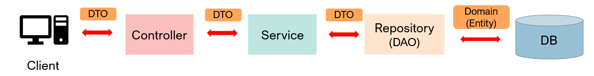

# 🏗️ SpringBoot Architecture
 

    <h4>📦 Spring Boot Project Structure</h4>
    <pre class="tree">
📦 com.example.project
 ┣ 📂 controller&nbsp;&nbsp;&nbsp;      <b>(1) 컨트롤러 계층</b>
 ┣ 📂 service&nbsp;&nbsp;          <b>(2) 서비스 계층</b>
 ┣ 📂 repository&nbsp;&nbsp;       <b>(3) 데이터 접근 계층</b>
 ┣ 📂 domain (model)&nbsp;&nbsp;   <b>(4) 도메인/엔티티 계층</b>
 ┣ 📂 dto&nbsp;&nbsp;              <b>(5) DTO 계층</b>
 ┣ 📂 config&nbsp;&nbsp;           <b>(6) 설정 관련 패키지</b>
 ┗ 📜 Application.java   <b>메인 클래스 (Spring Boot 실행)</b>  

</pre>
 
<b>🔥 Spring Boot 전체 흐름을 표현한 다이어그램</b>

